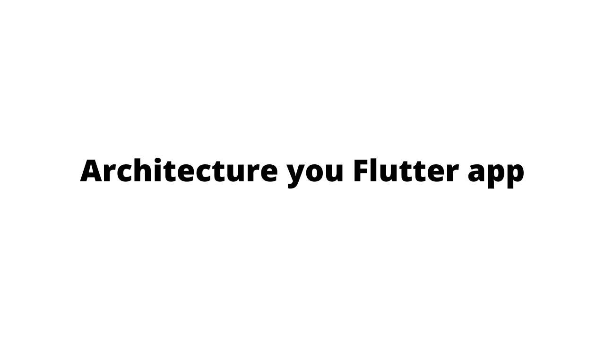

# My Apps Architecture

The project includes template for architecture of Flutter Apps.

I will explain each part a bit deeply in the previous sections. Sections are followings:

- bloc
- contractors
- data
  - model
  - service
  - repository
- presentation
  - widgets
  - pages
  - dialogs
  - shared
  - router
- utils  
  - constants
  - exceptions
  - extensions
  - localization
  - responsiveness
  - validators
- main.dart
    

> Template project uses JsonPlaceHolder api.

# Bloc
