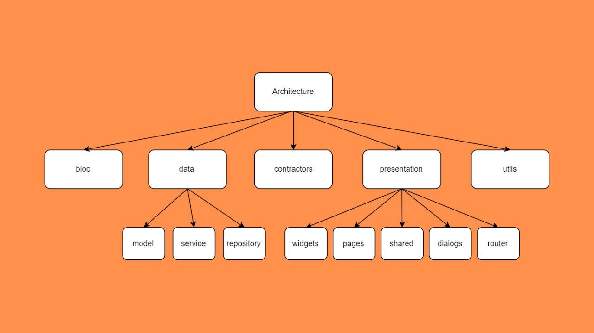

# My Apps Architecture

The project includes template for architecture of Flutter Apps.

I will explain each part a bit deeply in the previous sections. Sections are followings:

- `bloc`
- `data`
- `contractors`
- `data`
  - model
  - service
  - repository
- `presentation`
- `utils`
  - widgets
  - pages
  - dialogs
  - shared
  - router

> Template project uses JsonPlaceHolder api.

# bloc
